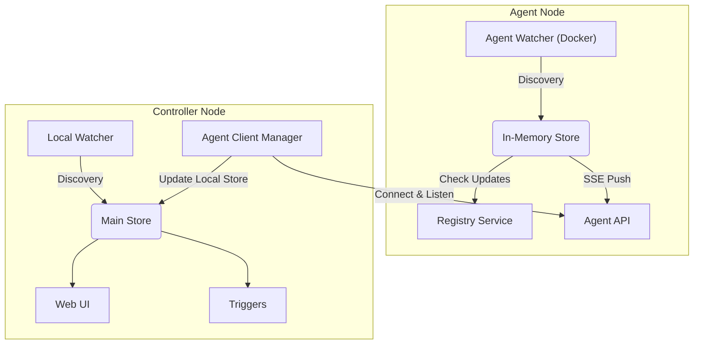

# Agent Mode Design

## Architecture

The Agent Mode allows running WUD in a distributed manner.
- **Agent Node**: Runs near the Docker socket (or other container sources). It performs **discovery** AND **update checks** (Registry queries). It sends fully hydrated Container objects (including update results) to the Controller. It does NOT persist state to disk.
- **Controller Node**: The central instance. It manages its own local watchers AND connects to remote Agents. It receives container reports from Agents, and handles persistence, UI, and Notifications.



## Configuration

### Agent Configuration
Run with `--agent` flag.

**Environment Variables:**
- `WUD_AGENT_SECRET`: Secret token for authentication (Required).
- `WUD_AGENT_SECRET_FILE`: Path to secret token file.
- `WUD_SERVER_PORT`: Port to listen on (default 3000).
- `WUD_SERVER_TLS_*`: TLS configuration (same as current).
- `WUD_WATCHER_{name}_*`: Watcher configuration (must have at least one).
- `WUD_REGISTRY_{name}_*`: Registry configuration (Required for update checks).
- `WUD_LOG_LEVEL`: Log level.

*Authentication (for UI) is ignored in Agent mode.*

### Controller Configuration
Configured via `WUD_AGENT_{name}_*` variables.

- `WUD_AGENT_{name}_SECRET`: Secret to connect to Agent (Required).
- `WUD_AGENT_{name}_SECRET_FILE`: File path for secret.
- `WUD_AGENT_{name}_HOST`: Hostname/IP of the Agent.
- `WUD_AGENT_{name}_PORT`: Port of the Agent (default 3000).
- `WUD_AGENT_{name}_CAFILE`, `CERTFILE`, `KEYFILE`: TLS certs for client connection.

## Communication Protocol

The Controller acts as the client, establishing connection to the Agent.

### Authentication
All requests from Controller to Agent must include:
`X-Wud-Agent-Secret: <SECRET>`

### 1. Handshake (Snapshot)
**Request:** `GET /api/containers`, `GET /api/watchers`, `GET /api/triggers`
**Purpose:** Initial state synchronization (containers, watchers, triggers).

### 2. Real-time Updates (SSE)
**Request:** `GET /api/events`
**Headers:** `Accept: text/event-stream`
**Protocol:**
SSE events are sent as a single JSON blob containing both type and data.
Format: `data: { "type": "...", "data": ... }`
**Event Types:**
- `wud:ack`: Sent immediately on connection. Payload `{ version: string }`.
- `wud:container-added`: Payload `Container` object.
- `wud:container-updated`: Payload `Container` object.
- `wud:container-removed`: Payload `{ id: string }`.

### 3. Remote Triggers
**Request:** `POST /api/triggers/:type/:name`
**Body:** JSON object of the container to trigger.
**Purpose:** Controller instructs Agent to execute a trigger (e.g. Docker Compose update) locally on the Agent.
**Logic:**
- Trigger execution requests for remote containers are proxied to the Agent.

**Request:** `POST /api/triggers/:type/:name/batch`
**Body:** JSON array of containers to trigger.
**Purpose:** Batch execution of triggers on the Agent.


### 4. Remote Trigger Discovery
**Request:** `GET /api/triggers`
**Response:** JSON array of triggers configured on the Agent.

### 5. On-Demand Watch
**Request:** `POST /api/watchers/:type/:name`
**Purpose:** Trigger a specific watcher on the Agent to perform a discovery pass immediately.
**Response:** JSON array of discovered containers.

**Request:** `POST /api/watchers/:type/:name/container/:id`
**Purpose:** Trigger a specific watcher on the Agent to discover a single container (looked up by ID in Agent's store).
**Response:** JSON object of the discovered container.

## Data Model Changes

### Container
Add field:
```typescript
agent?: string; // Name of the agent. Undefined/Null if local.
```

### Watcher
Add field:
```typescript
agent?: string; // Name of the agent. Undefined/Null if local.
```

## Component Changes

### 1. Store (`app/store`)
- **Agent Mode**: Must use an in-memory database (LokiJS without persistence/autosave).
- **Controller Mode**: Continues to use persistent file storage.

### 2. Watchers (`app/watchers/providers/docker/Docker.ts`)
- **Fix**: Ensure `getContainers` filters correctly by Agent. Local watchers must NOT prune remote containers.
- **Agent Mode**: Watchers run in full mode (Discovery + Registry Check).
- **API**:
    - `GET /api/watchers` returns both local and agent watchers.
    - New endpoint `GET /api/watchers/:agent/:type/:name` for agent watcher details.
    - `GET /api/triggers` returns both local and agent triggers.
    - New endpoint `GET /api/triggers/:agent/:type/:name` for agent trigger details.
    - New endpoint `POST /api/triggers/:agent/:type/:name` to execute agent trigger.

### 3. Agent Server (`app/agent/api/index.ts`)
- New component.
- Starts Express app with specific Agent endpoints.
- Uses `app/event` to subscribe to local watcher events and push them to SSE clients.

### 4. Agent Client (`app/agent/AgentClient.ts`)
- New component on Controller.
- Manages connection to one specific Agent.
- Performs Handshake.
- Maintains SSE connection (robust reconnect logic with error handling).
- On event:
    - Normalizes container data (adds `agent` field).
    - Updates the **Main Store**.
    - **Crucial**: Emits `wud:container-report` event if the container has changed/updated, so that **Triggers** on the Controller are fired.
- **Changed**: Does NOT perform Registry lookups. Relies on Agent data.

### 5. Registry Logic
- Agent now performs registry lookups.
- Controller continues to perform registry lookups for LOCAL containers.

### 6. Agent Configuration & Management
- **Agent Component (`app/agent/Agent.ts`)**: New Component class representing a remote agent configuration.
- **Registry Integration (`app/registry/index.ts`)**: Agents are registered as components (`registry.getState().agent`) based on environment variables.
- **Agent Manager (`app/agent/index.ts` & `app/agent/manager.ts`)**: Iterates over registered Agent components to instantiate and manage `AgentClient` runtime instances. `manager.ts` provides access to these instances to avoid circular dependencies.

## Frontend Changes
- **Configuration**: Add "Agents" section.
- **Containers**:
    - Filter by Agent.
    - Show "Agent: {name}" in details.
    - Container Card Title: Shows `[Agent] / [Watcher] / [Name] : [Version]` (Agent pill is green if connected, red if disconnected).
- **Watchers**: Show which Agent a watcher belongs to.
- **ID Handling**: Since Agents might return Watchers/Triggers with the same IDs as the Controller (or other Agents), the Frontend uses a composite key (e.g. `${agent || '_local'}.${id}`) in lists to ensure uniqueness and prevent rendering collisions.

## Security
- Agent endpoints protected by Secret.
- HTTPS supported.
