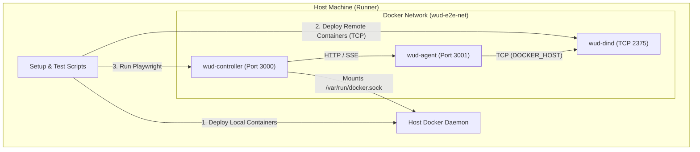

# E2E UI Test Environment Plan

## Goals
1.  **Unified Test Environment**: Replace the single-node test setup with a hybrid (Controller + Agent) setup for all UI E2E tests.
2.  **Isolation**: Use Docker-in-Docker (`dind`) to simulate a true remote environment for the Agent, ensuring "Remote Triggers" and file-system operations are isolated from the Controller/Host.
3.  **Coverage**: Verify that the UI correctly displays and filters containers from both sources, and that actions (triggers) work across the wire.

## Architecture

## Implementation Steps

### 1. Infrastructure Scripts

- [x] **Update `scripts/cleanup-test-containers.sh`**
    - Add command to remove the docker network `wud-e2e-net` at the end of the script: `docker network rm wud-e2e-net 2>/dev/null || true`.

- [x] **Update `scripts/setup-test-containers.sh`**
    - **Logic Change**: Modify the script to accept a `MODE` argument (or env var) and `TARGET_DOCKER_HOST`.
        - If `TARGET_DOCKER_HOST` is set, execute docker commands against that host.
        - **Mode `full` (default)**: Execute the current full list of container deployments.
        - **Mode `minimal`**: Deploy only a small subset:
            - `nginx:1.10-alpine` (simulates update available).
            - `nginx:latest` (simulates up-to-date).
            - Add a label `wud.tag.include=^latest$` to `nginx:latest` and `wud.tag.include=^\d+\.\d+-alpine$` to `nginx:1.10-alpine` (copying from full setup) to ensure they are discovered.
            - Ensure distinct names if necessary (e.g., prefix `remote_` if name collision matters, though Agent separation handles this).

- [x] **Create `scripts/start-wud-e2e-mixed.sh`**
    - **Script Structure**:
        1.  **Network**: Create `wud-e2e-net`.
        2.  **Dind**: Start `docker:dind` container.
            - Name: `wud-dind`.
            - Privileged mode (`--privileged`).
            - Network: `wud-e2e-net`.
            - Expose port: Map internal 2375 to a host port (e.g., 2376) for the setup script to access.
            - Env: `DOCKER_TLS_CERTDIR=""` (disable TLS for simplicity).
        3.  **Wait**: Implement a loop waiting for `wud-dind` to be responsive (e.g., `docker -H tcp://localhost:2376 info`).
        4.  **Setup Host**: Run `scripts/setup-test-containers.sh` (Mode: `full`).
        5.  **Setup Remote**: Run `scripts/setup-test-containers.sh` with `TARGET_DOCKER_HOST=tcp://localhost:2376` and Mode: `minimal`.
        6.  **Agent**: Start `wud-agent` container.
            - Network: `wud-e2e-net`.
            - Env `DOCKER_HOST=tcp://wud-dind:2375`.
            - Env `WUD_AGENT_SECRET=testsecret`.
            - Port: 3001:3000.
        7.  **Controller**: Start `wud-controller` container.
            - Network: `wud-e2e-net`.
            - Mount `/var/run/docker.sock`.
            - Env `WUD_AGENT_REMOTE_HOST=wud-agent`.
            - Env `WUD_AGENT_REMOTE_SECRET=testsecret`.
            - Port: 3000:3000.

- [x] **Update `scripts/run-ui-tests.sh`**
    - Replace the call to `start-wud.sh` with `start-wud-e2e-mixed.sh`.

### 2. NPM Scripts

- [x] **Update `ui-e2e/package.json`**
    - Add script `"test:e2e": "../scripts/run-ui-tests.sh"`.

### 3. Playwright Tests

- [x] **3.1 Update `ui-e2e/tests/containers.spec.ts`**
    - **Verify Agent Filter**: Check that the "Agent" filter dropdown is present on the Containers page.
    - **Verify Remote Containers**: Check that containers from the Agent (e.g., the `nginx` ones from minimal setup) are visible.
        - *Strategy*: Use the Agent column/pill or specific container names to distinguish.
    - Run `npm run test:e2e:` from `ui-e2e/package.json` and ensure existing and newly added tests pass with the new mixed topology.

- [x] **3.2 Create `ui-e2e/tests/agent.spec.ts`**
    - **Test 1: Agent Status**:
        - Navigate to Configuration > Agents.
        - Verify "remote" agent is listed.
        - Verify status is "Connected" (Green pill/indicator).
    - **Test 2: Remote Update (Optional/Future)**:
        - Trigger update on a remote container.
        - Assert success toast.
    - Run `npm run test:e2e:` from `ui-e2e/package.json` and ensure existing and newly added tests pass with the new mixed topology.