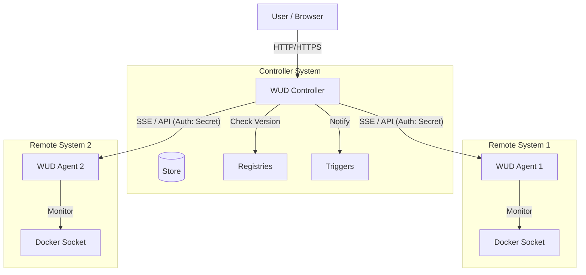
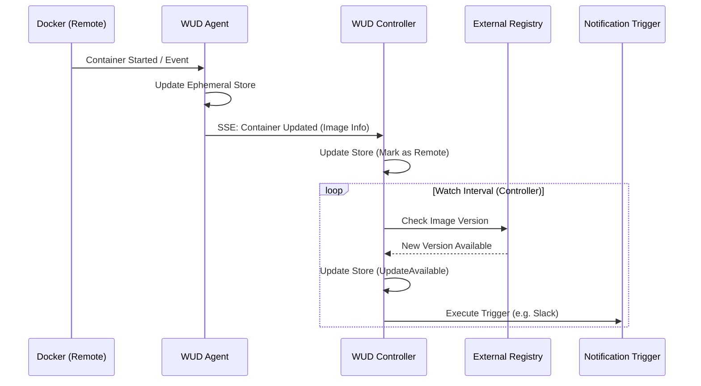

# Agent Mode Architecture

## Overview

WUD supports a distributed architecture where "Agent" instances monitor containers on remote systems and report to a central "Controller".

- **Controller**: The central WUD instance hosting the WebUI, managing Triggers (notifications), and performing Version Checks against Registries.
- **Agent**: A lightweight WUD instance running on a remote system. It monitors the local Docker socket (Discovery) and pushes container state to the Controller. It does **not** check registries. It can execute local triggers (e.g. updating docker-compose files) when instructed by the Controller.

## Architecture

### System Diagram

### Components

#### Agent
- **Mode**: Started with `--agent` flag.
- **Store**: Ephemeral (In-Memory), no persistence. Used for diffing state.
- **Watcher**: Runs in "Discovery Only" mode. Gets container info + image tags, but skips registry version checks.
- **Server**: Exposes API for Snapshot (`GET /api/containers`) and SSE (`GET /api/events`). Protected by `WUD_AGENT_SECRET`.
- **Triggers**: Can run local triggers (e.g. `DockerCompose`) when invoked by Controller via API.

#### Controller
- **Mode**: Default mode.
- **Agent Client**: Manages connections to Agents.
  - Handshake: Fetches full snapshot on connect.
  - Listen: Updates local store on SSE events from Agent.
- **Registry**: Performs version checks for both local and remote containers.
- **Store**: Stores all containers. Remote containers are marked with `agent` attribute.

### Sequence Diagram: Container Update

### Configuration

#### Agent Configuration
- `WUD_AGENT_SECRET`: Shared secret.
- `WUD_WATCHER_{name}_*`: Watcher config (e.g. Docker socket).

#### Controller Configuration
- `WUD_AGENT_{name}_SECRET`: Secret to connect to Agent.
- `WUD_AGENT_{name}_HOST`: Hostname of Agent.
- `WUD_AGENT_{name}_PORT`: Port of Agent.
