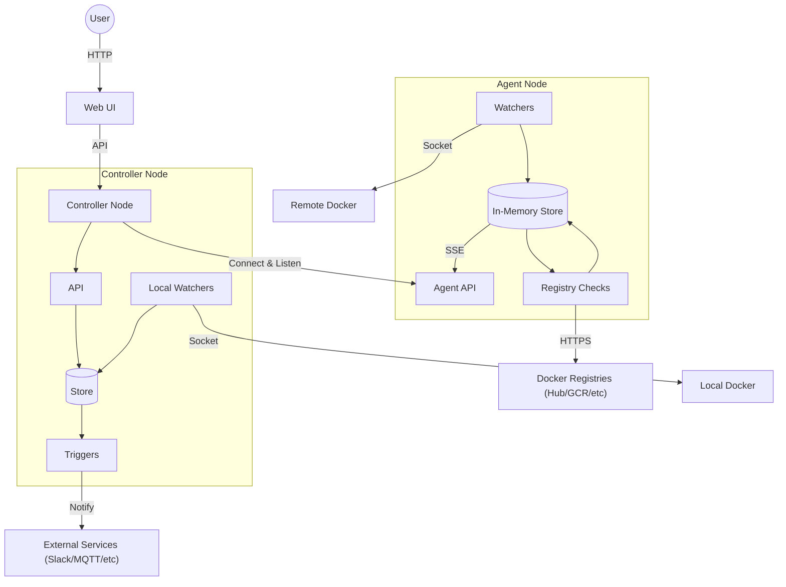
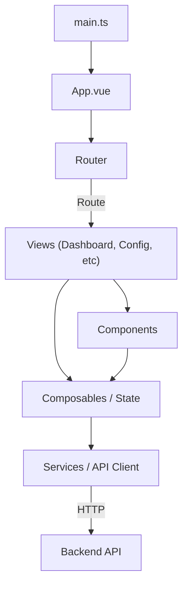
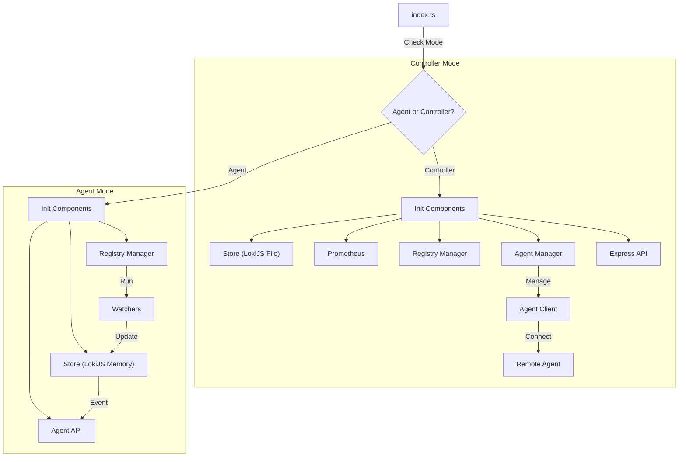

# WUD Repository Guide for Agents

This document provides context, architectural overview, and validation instructions for autonomous agents working on the WUD repository.

## Agent workflow (superpowers + Paseo)

These are declared preferences; they override the superpowers skills' defaults.

- **Worktrees are owned by Paseo** (`paseo.json` runs `npm ci` in `app/` and `ui/` and copies `.env`
  on creation; they live under `~/.paseo/worktrees/`). If already in a linked worktree, work there.
  Never use `EnterWorktree` or `git worktree add`. From the main checkout, create a Paseo worktree
  (`paseo worktree create --mode branch-off --new-branch <name>`, or `mcp__paseo__create_workspace`)
  — the main checkout may be shared with other agents, so **never move it off its current branch**;
  if a task seems to require that, ask first. Don't run `npm install` in a worktree; if dependencies
  are missing, run `npm ci` in that package (`e2e/` and `ui-e2e/` are not installed by setup —
  `npm ci` them on demand, plus `npx playwright install` for `ui-e2e/`).
- **Before running tests in, or removing, a worktree, read `.claude/runbooks/worktrees.md`.**
- **Baseline / verification** is `(cd app && npm test)` and `(cd ui && npm test)` — there is no root
  manifest. `npm run lint` does not typecheck; also run `npx tsc --noEmit` in `app/`. Run the e2e suite
  (`cd e2e && npm test`, ~15 min) only for changes to watchers, registries, triggers, the agent
  protocol, the API or the harness itself. It is a **machine-wide singleton** (fixed container names,
  network `wud-e2e-net`, host ports 3000/3001/2376, image tag `wud:latest`) — never run two at once,
  check `docker ps` first, and always go through the npm scripts so the image is rebuilt from this
  worktree: `wud:latest` otherwise belongs to whichever branch built last.
- **Finishing a branch:** always push and open a PR against `dev`; never merge into `dev` locally.
  The PR title must be the squash subject in Conventional Commits form (see below), since that alone
  decides what release-please releases. Doc-only PRs carry `[no ci]` at the end of the PR title
  **only** — never in a branch commit, which would skip the required PR check and block the merge.
  Archive the worktree through Paseo, then delete the merged branch (`git branch -D` — squash merges
  leave it "unmerged"). Worktrees removed any other way: run `scripts/lumen-prune.sh` afterwards.
- **Specs** go in `dev/specs/YYYY-MM-DD-<feature>.md` (`docs/` is the published site), committed as
  `docs:` on the feature branch.
- **Plans** and other agent workflow artifacts **never** get committed into the tree.

## Commit Message Conventions

This repo uses [release-please](https://github.com/googleapis/release-please) (introduced in PR #32) to
produce semantic versions from commit history. Every merge commit message MUST start with a
[Conventional Commits](https://www.conventionalcommits.org/) prefix that release-please understands —
e.g. `fix:` (patch), `feat:` (minor), `feat!:` or a `BREAKING CHANGE:` footer (major), or `chore:` /
`docs:` / `test:` (no release). PRs are squash-merged, so the PR title becomes the merge commit message
and needs the prefix too.

## Architecture

### High-Level Architecture

WUD can operate in two modes: **Controller** (Standalone/Central) and **Agent** (Distributed).



### Frontend Architecture (Low-Level)

The frontend is a **Vue 3** application using **Vuetify** for UI components. It uses the Composition API and Composables for state management.



### Backend Architecture (Low-Level)

The backend is a **Node.js** application written in **TypeScript**. It branches into two distinct runtime modes based on the `--agent` flag.



## Introduction

WUD (What's Up Docker?) is a self-hosted tool that monitors Docker containers, checks for image updates on remote registries, and notifies users or performs actions (triggers) when updates are found.

## Project Structure

### `app/` (Backend)
The server-side Node.js application.
- **`agent/`**: Logic specific to Agent mode and Controller-Agent communication.
    - **`AgentClient.ts`**: Controller-side client that connects to an Agent.
    - **`api/`**: Agent-side Express server (handles SSE and snapshots).
    - **`manager.ts`**: Controller-side manager for AgentClient instances.
- **`api/`**: Controller-side Express application, API routes, and UI serving.
- **`configuration/`**: Application configuration loading and validation.
- **`model/`**: Core data interfaces (e.g., `Container`).
- **`store/`**: Data persistence using LokiJS.
    - Controller: Persists to `wud.json`.
    - Agent: In-memory only.
- **`watchers/`**: Logic for discovering running containers.
- **`triggers/`**: Logic for executing actions (notifications/webhooks).
- **`registries/`**: Logic for querying external container registries for tags/digests.

### `ui/` (Frontend)
The client-side Vue.js 3 application.
- **`src/`**: Source code.
    - **`components/`**: Reusable Vue components.
    - **`services/`**: API client modules.
    - **`views/`**: Top-level page components.
    - **`composables/`**: Shared state logic (Composition API).
    - **`router/`**: Vue Router configuration.

### `e2e/` (Backend Integration Tests)
Cucumber-based integration tests for the backend.

### `ui-e2e/` (Frontend E2E Tests)
Playwright-based end-to-end tests for the frontend.

## Agent Mode Details

**Agent Node**:
- Runs near the Docker socket.
- Performs discovery (Watchers) AND update checks (Registries).
- Sends fully hydrated Container objects to the Controller via SSE.
- Does NOT persist state to disk.

**Controller Node**:
- The central instance.
- Manages local watchers AND connects to remote Agents.
- Receives container reports from Agents.
- Handles persistence, UI, and Triggers.

## Validation & Testing

**IMPORTANT:** Do NOT execute scripts located in the `scripts/` directory directly. Always use the NPM scripts defined in the respective package directories.

### Backend (`app/`)
1.  `cd app`
2.  **Linting:** `npm run lint`
3.  **Formatting:** `npm run format`
4.  **Unit Tests:** `npm test`

### Frontend (`ui/`)
1.  `cd ui`
2.  **Linting:** `npm run lint`
3.  **Unit Tests:** `npm test`

### Backend Integration (`e2e/`)
1.  `cd e2e`
2.  **Run Tests:** `npm test`

`npm test` is `dotenvx run -f ../.env -- ../scripts/run-e2e-tests.sh`. The wrapper is what loads `.env`;
the shell scripts under `scripts/` do **not** load it themselves. Starting the stack with a raw
`scripts/start-wud.sh` or `scripts/run-e2e-tests.sh` and then running cucumber through npm produces exactly
7 failures that look like registry problems but are a harness mismatch: `ECR_REGISTRY_URL` / `AWS_REGION`
expected `us-west-2` but the controller was started against the `eu-west-1` fallback image, and
`EXPECTED_TAG` comes back `null` on lscr/ghcr containers because the controller got dummy tokens.

If your tool cannot keep one command alive for the full run (~15 min: image build, Docker-in-Docker stack,
70 cucumber scenarios), split it into the two halves that are already exposed as npm scripts and run each
in the background:

```bash
cd e2e && npm run test:cleanup && npm run test:start-wud   # build image, start dind + agent + controller, seed fixtures
cd e2e && npm run cucumber                                  # run the suite against the live stack
cd e2e && npm run test:cleanup                              # tear the stack down afterwards
```

Read only the cucumber totals (`grep -E 'scenarios \(|steps \('`) and the `Failures:` block from the log;
the full output is large. Detaching the run with `nohup`/`setsid` from an agent sandbox does not work — the
process is killed and no log is written.

### Frontend E2E (`ui-e2e/`)
1.  `cd ui-e2e`
2.  **Run Tests:** `npm test`

## Additional Design Documentation

- [Agent Mode](dev/agent-mode.md)