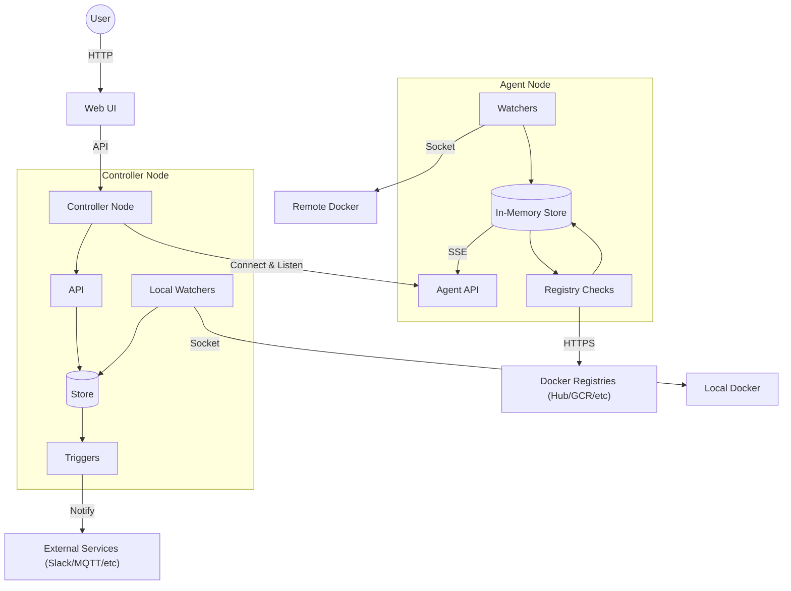
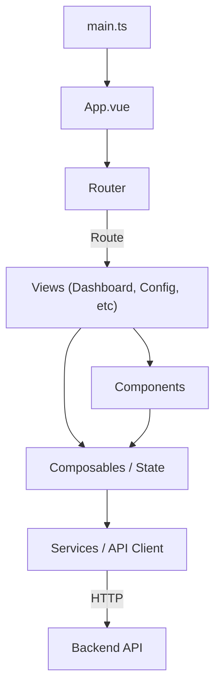
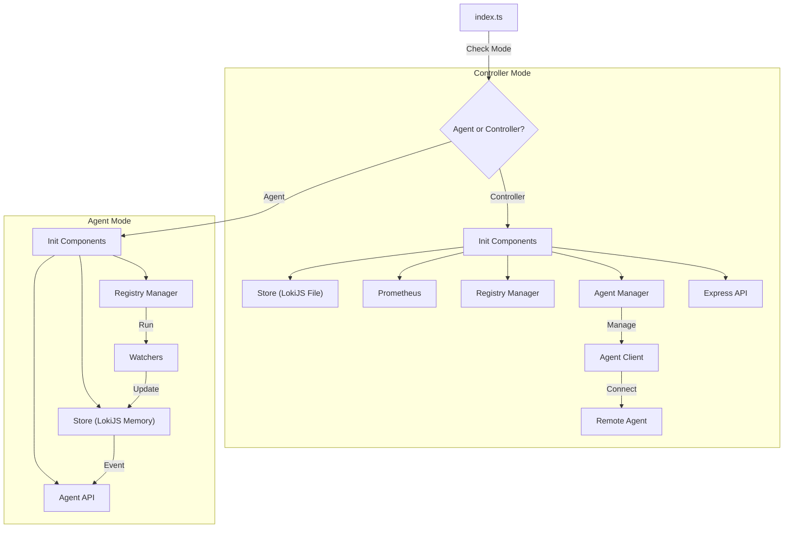

# WUD Repository Guide for Agents

This document provides context, architectural overview, and validation instructions for autonomous agents working on the WUD repository.

## Architecture

### High-Level Architecture

WUD can operate in two modes: **Controller** (Standalone/Central) and **Agent** (Distributed).

### Frontend Architecture (Low-Level)

The frontend is a **Vue 3** application using **Vuetify** for UI components. It uses the Composition API and Composables for state management.

### Backend Architecture (Low-Level)

The backend is a **Node.js** application written in **TypeScript**. It branches into two distinct runtime modes based on the `--agent` flag.

## Introduction

WUD (What's Up Docker?) is a self-hosted tool that monitors Docker containers, checks for image updates on remote registries, and notifies users or performs actions (triggers) when updates are found.

## Project Structure

### `app/` (Backend)
The server-side Node.js application.
- **`agent/`**: Logic specific to Agent mode and Controller-Agent communication.
    - **`AgentClient.ts`**: Controller-side client that connects to an Agent.
    - **`api/`**: Agent-side Express server (handles SSE and snapshots).
    - **`manager.ts`**: Controller-side manager for AgentClient instances.
- **`api/`**: Controller-side Express application, API routes, and UI serving.
- **`configuration/`**: Application configuration loading and validation.
- **`model/`**: Core data interfaces (e.g., `Container`).
- **`store/`**: Data persistence using LokiJS.
    - Controller: Persists to `wud.json`.
    - Agent: In-memory only.
- **`watchers/`**: Logic for discovering running containers.
- **`triggers/`**: Logic for executing actions (notifications/webhooks).
- **`registries/`**: Logic for querying external container registries for tags/digests.

### `ui/` (Frontend)
The client-side Vue.js 3 application.
- **`src/`**: Source code.
    - **`components/`**: Reusable Vue components.
    - **`services/`**: API client modules.
    - **`views/`**: Top-level page components.
    - **`composables/`**: Shared state logic (Composition API).
    - **`router/`**: Vue Router configuration.

### `e2e/` (Backend Integration Tests)
Cucumber-based integration tests for the backend.

### `ui-e2e/` (Frontend E2E Tests)
Playwright-based end-to-end tests for the frontend.

## Agent Mode Details

**Agent Node**:
- Runs near the Docker socket.
- Performs discovery (Watchers) AND update checks (Registries).
- Sends fully hydrated Container objects to the Controller via SSE.
- Does NOT persist state to disk.

**Controller Node**:
- The central instance.
- Manages local watchers AND connects to remote Agents.
- Receives container reports from Agents.
- Handles persistence, UI, and Triggers.

## Validation & Testing

**IMPORTANT:** Do NOT execute scripts located in the `scripts/` directory directly. Always use the NPM scripts defined in the respective package directories.

### Backend (`app/`)
1.  `cd app`
2.  **Linting:** `npm run lint`
3.  **Formatting:** `npm run format`
4.  **Unit Tests:** `npm test`

### Frontend (`ui/`)
1.  `cd ui`
2.  **Linting:** `npm run lint`
3.  **Unit Tests:** `npm test`

### Backend Integration (`e2e/`)
1.  `cd e2e`
2.  **Run Tests:** `npm test`

### Frontend E2E (`ui-e2e/`)
1.  `cd ui-e2e`
2.  **Run Tests:** `npm test`