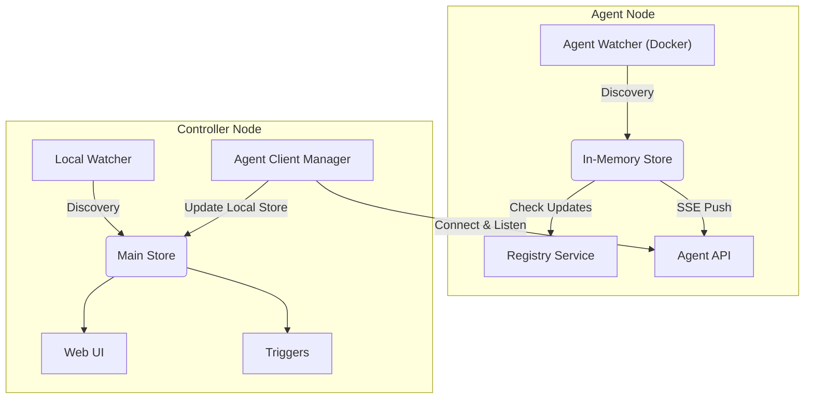

# Agent Mode - Developer Guide

This document details the design, architecture, and implementation of the Agent Mode feature in WUD. It is intended for developers working on the repository to understand the distributed monitoring capabilities.

## 1. Overview

The **Agent Mode** allows running WUD in a distributed manner.
- **Agent Node**: Runs near the Docker socket (or other container sources) on remote machines. It performs **discovery** AND **update checks** (Registry queries). It sends fully hydrated `Container` objects (including update results) to the Controller. It does NOT persist state to disk.
- **Controller Node**: The central instance. It manages its own local watchers AND connects to remote Agents. It receives container reports from Agents, and handles persistence, UI, and Notifications.

## 2. Architecture



### Key Differences
| Feature | Agent Mode | Controller Mode |
| :--- | :--- | :--- |
| **Persistence** | In-Memory (Ephemeral) | File-based (LokiJS) |
| **Registry Checks** | **Enabled** (Decoupled from Watcher in v2, but re-integrated for Agent Mode) | Enabled for Local Watchers |
| **Triggers** | Only `docker` & `dockercompose` (Local actions) | All Notification Triggers + Remote Actions |
| **API** | Specialized Agent API | Full REST API |

## 3. Communication Protocol

The **Controller** acts as the client, establishing an HTTP/HTTPS connection to the **Agent**.

### Authentication
All requests from Controller to Agent must include the header:
`X-Wud-Agent-Secret: <SECRET>`

### Connection Flow
1.  **Handshake**: The Controller requests a snapshot of the Agent's state.
    -   `GET /api/containers`
    -   `GET /api/watchers`
    -   `GET /api/triggers`
2.  **Real-time Updates (SSE)**: The Controller opens a persistent Server-Sent Events stream.
    -   `GET /api/events`
    -   The Agent pushes events whenever its internal state changes (Container added/updated/removed).

### Server-Sent Events (SSE) Protocol
Events are sent as JSON objects wrapped in the standard SSE format.

**Format:**
```
data: { "type": "...", "data": ... }
```

**Event Types:**
-   `wud:ack`: Sent immediately on connection. Payload `{ version: string }`.
-   `wud:container-added`: Payload `Container` object.
-   `wud:container-updated`: Payload `Container` object.
-   `wud:container-removed`: Payload `{ id: string }`.

## 4. Agent API Reference

The Agent exposes the following endpoints (on port `3000` by default).

### State Synchronization
-   `GET /api/containers`: List all containers in the Agent's memory.
-   `GET /api/watchers`: List configured watchers.
-   `GET /api/triggers`: List configured triggers.

### Operations
-   `POST /api/watchers/:type/:name`: Force a specific watcher to run immediately.
-   `POST /api/watchers/:type/:name/container/:id`: Force a watch on a specific container.
-   `DELETE /api/containers/:id`: Delete a container from the store (requires `WUD_SERVER_FEATURE_DELETE=true`).
-   `POST /api/triggers/:type/:name`: Execute a trigger on the Agent (e.g., updating a container). Body: `Container` object.

### Real-time Stream
-   `GET /api/events`: SSE Stream. Headers: `Accept: text/event-stream`.

## 5. Configuration

### Agent Configuration
Run with `--agent` flag.

**Key Environment Variables:**
-   `WUD_AGENT_SECRET`: Shared secret.
-   `WUD_WATCHER_{name}_*`: Watcher config (Mandatory).
-   `WUD_REGISTRY_{name}_*`: Registry config.

### Controller Configuration
Configured via `WUD_AGENT_{name}_*` variables.

-   `WUD_AGENT_{name}_SECRET`: Shared secret.
-   `WUD_AGENT_{name}_HOST`: Agent Hostname/IP.
-   `WUD_AGENT_{name}_PORT`: Agent Port.

## 6. Implementation Details

### Data Model Changes
-   **`Container`**: Added `agent` field (string, name of the agent). Undefined for local containers.
-   **`Watcher`**: Added `agent` field.

### Core Components
1.  **Store (`app/store`)**: Refactored to support an **In-Memory** adapter when running in Agent mode, disabling autosave.
2.  **Watchers**:
    -   In Agent Mode, they run normally (Discovery + Registry Check).
    -   **Important**: The `docker` watcher was updated to filter pruning. Local watchers must NOT prune containers belonging to remote agents.
3.  **Agent Server (`app/agent/api`)**: Express app serving the Agent API. Uses `app/event` to listen for local changes and broadcast them to SSE clients.
4.  **Agent Client (`app/agent/AgentClient.ts`)**:
    -   Runs on the **Controller**.
    -   Manages the connection (Handshake + SSE) to a specific Agent.
    -   **Normalization**: Inject the `agent` name into incoming container objects.
    -   **Sync**: Updates the main store with data from the Agent.
    -   **Event Emission**: Emits `wud:container-report` when a remote container changes, triggering notifications on the Controller.

### Testing
-   **E2E Tests**: A full integration test (Controller + Agent) is available in `e2e/`. It spins up two WUD instances and verifies discovery and communication.
